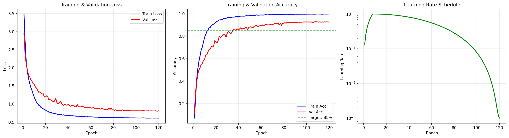
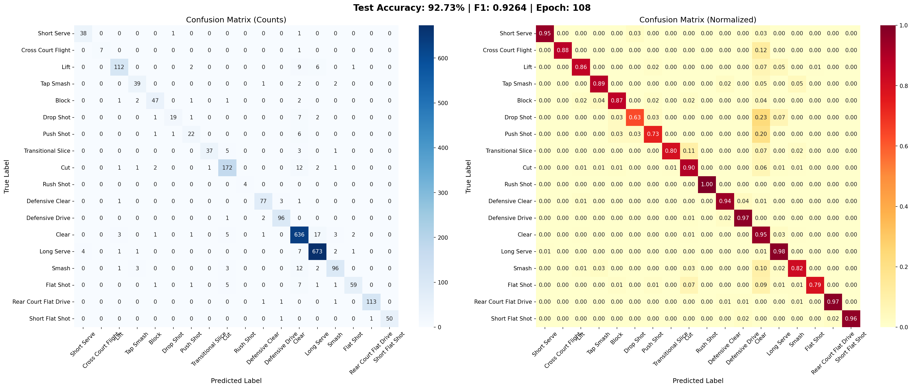
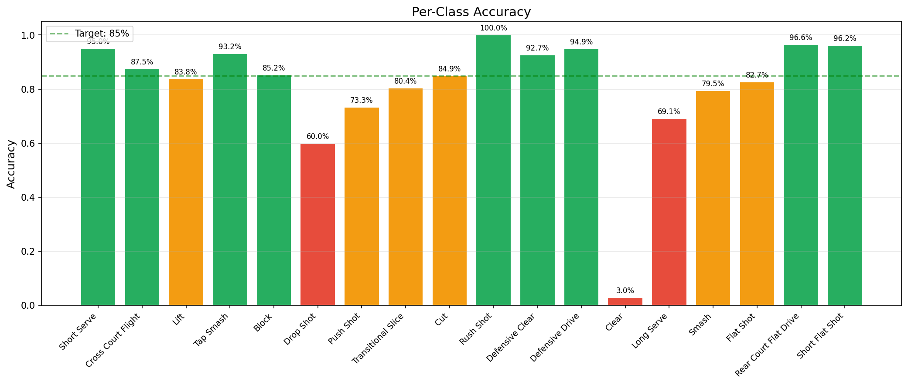

# 鹰眼智析 — 羽毛球战术分析系统

> 基于多模态 AI 的羽毛球运动姿态识别与战术分析平台

实时动作识别 · 球落点热力图 · 飞行轨迹预测 · 智能训练建议

---

## 项目起源

本项目是一名计算机相关专业大二学生的深度学习课程设计，构思源于 2026 年 4 月一次羽毛球队的日常训练。整体框架搭建与正式开发自 2026 年 5 月 1 日全面启动，从零实现了从数据处理、模型训练到实时推理的完整闭环。

一次实战对抗中，队友指出我的击球线路过于单一、球路规律极易预判——然而身处其中的我却很难直观察觉到这些技术短板。身为学院羽毛球队队长，我深知"知道问题在哪"和"看到问题在哪"之间的鸿沟：队友不可能时刻在场，而凭主观感受复盘往往流于模糊。

于是我萌生了一个想法：**能否用计算机视觉技术，将球场上的每一个动作、每一次击球落点都量化、可视化，让隐藏在本能中的习惯暴露在数据面前？**

这个想法便是鹰眼智析的起点。从关键点提取到动作分类，从球检测到落点热力图，系统逐步成型。如今，它不仅能实时识别 18 种击球动作，还能生成球场热力图和训练建议报告——将原本依赖经验的训练复盘，变成了可量化、可追踪的数据驱动分析。

由于本人技术实在有限，此项目需要修改完善的地方还有很多很多......

🔧 **持续更新中...**

---

## 核心功能

- **18 种击球动作识别** — 发球、杀球、吊球、高远球、网前球等全覆盖
- **球落点热力图** — 基于透视变换的球场坐标映射，精准呈现落点分布
- **球员步伐热力图** — 分析移动范围与站位习惯
- **飞行轨迹拟合** — 卡尔曼跟踪 + 多项式拟合，预测球落点
- **智能训练建议** — 视频播放一轮后自动生成中文分析报告

---

## 效果展示


*视频 + 骨架叠加 + 球轨迹 + 球场热力图 + 动作识别*

---

## 技术架构

```
┌─────────────────────────────────────────────────────────┐
│                    动作识别管线                           │
│                                                         │
│  视频 → YOLOv8-Pose → 17关键点 → 特征工程(128维)           │
│       → 滑动窗口(15帧) → BiLSTM + 注意力池化 → 动作分类      │
└─────────────────────────────────────────────────────────┘

┌─────────────────────────────────────────────────────────┐
│                    球场分析管线                           │
│                                                         │
│  视频 → 混合球检测(运动+颜色+YOLO) → 卡尔曼滤波跟踪           │
│       → 透视变换 → 球场坐标映射 → 热力图 + 落点统计           │
└─────────────────────────────────────────────────────────┘
```

---

## 项目结构

```
badminton_pose/
├── config.py                 # 全局配置（超参数、路径、模型设置）
├── run.py                    # 主入口脚本（完整流程编排）
├── train.py                  # 模型训练
├── evaluate.py               # 模型评估（混淆矩阵、准确率）
├── gui_inference.py          # 实时推理 GUI
├── requirements.txt          # Python 依赖
├── court.jpg                 # 球场底图
├── modules/
│   ├── keypoint_extractor.py # YOLOv8-Pose 关键点提取
│   ├── preprocessor.py       # 降噪 + 特征工程（128维/帧）
│   ├── dataset_builder.py    # 滑动窗口数据集 + 增强
│   ├── model.py              # BiLSTM 分类器（注意力池化）
│   ├── transformer_model.py  # Transformer 分类器（备选）
│   ├── focal_loss.py         # Focal Loss（类别不均衡）
│   ├── ball_detector.py      # 球检测 + 卡尔曼跟踪 + 轨迹拟合
│   ├── court_detector.py     # 球场检测 + 手动标定
│   ├── court_mapper.py       # 像素↔球场坐标映射
│   ├── heatmap_generator.py  # 球场热力图生成
│   └── advisor.py            # 训练建议生成器
├── weights/
│   └── yolo11s-ball.pt       # 羽毛球专用检测模型（需下载）
├── outputs/
│   ├── keypoints/            # 关键点数据（.npy）
│   ├── datasets/             # 构建好的数据集
│   ├── models/               # 训练好的模型权重
│   ├── curves/               # 训练曲线与评估图表
│   └── heatmap_exports/      # 导出的热力图图片
└── models/                   # 预训练权重（YOLOv8）
```

---

## 支持的动作类别

| 分组 | 动作 |
|:---:|:---|
| **进攻** | Smash（杀球）、Tap Smash（点杀）、Drop Shot（吊球）、Rush Shot（扑球）、Cut（切球） |
| **防守** | Block（挡网）、Lift（挑球）、Defensive Clear（防守高远球）、Defensive Drive（防守平抽） |
| **发球** | Short Serve（短发球）、Long Serve（长发球） |
| **网前** | Push Shot（推球）、Flat Shot（平抽球）、Short Flat Shot（网前平球） |
| **过渡** | Clear（高远球）、Cross Court Flight（斜线球）、Transitional Slice（过渡切球）、Rear Court Flat Drive（后场平抽） |

---

## 快速开始

### 环境要求

- Python >= 3.10
- CUDA（可选，GPU 加速训练）

### 安装依赖

```bash
pip install -r badminton_pose/requirements.txt
```

### 运行

```bash
python badminton_pose/gui_inference.py
```

---

## 使用说明

### 1. 实时推理 GUI

启动后进入主界面，左侧为视频播放区，右侧面板显示分析结果。

**操作步骤：**

1. **加载视频** — 点击工具栏「加载视频」选择视频文件，或点击「摄像头」使用实时摄像头
2. **标定球场** — 视频暂停在第一帧，在画面上依次点击球场四个角点（左上 → 左下 → 右下 → 右上），点击「标定球场」确认
3. **自动推理** — 标定完成后系统自动开始动作识别和球跟踪
4. **查看结果** — 右侧面板实时更新热力图和识别结果

**工具栏功能：**

| 按钮 | 功能 |
|:---|:---|
| 加载视频 | 选择本地视频文件 |
| 摄像头 | 使用摄像头实时分析 |
| 标定球场 | 在视频画面上点击 4 个角点标定 |
| 水平翻转 | 镜像翻转球场坐标映射 |
| 垂直翻转 | 上下翻转球场坐标映射 |
| 停止 | 暂停推理 |
| 重置热力图 | 清除所有累积的热力图数据 |

**右侧面板：**

- **球落点热力图** — 球场上落点密度分布
- **球员步伐热力图** — 球员移动范围热力图
- **训练建议** — 视频播放一轮后自动生成中文分析报告
- **识别结果** — 当前动作类别、置信度、Top-5 概率

### 2. 球场标定

准确的球场标定是热力图精度的关键。

**手动标定流程：**

1. 点击「标定球场」按钮，视频暂停在第一帧
2. 在画面上按顺序点击 4 个角点：
   - 第 1 点：球场**左上**角
   - 第 2 点：球场**左下**角
   - 第 3 点：球场**右下**角
   - 第 4 点：球场**右上**角
3. 系统自动计算透视变换矩阵

**标定提示：**

- 点击位置应尽量精确，贴近球场边界线交点
- 如果标定结果不准确，可点击「重置热力图」后重新标定
- 支持「水平翻转」和「垂直翻转」修正摄像头镜像问题
- 自动标定失败时会使用默认映射（精度较低）

### 3. 训练建议

视频播放一轮后自动生成，包含以下分析维度：

- **动作分布** — 各动作占比、进攻/防守比例分析
- **落点分布** — 前/后场、左/右半场分布、落点集中度
- **步伐分析** — 移动范围、平均站位偏移
- **技术多样性** — 使用动作种类数、缺失技术提示

### 4. 模型训练

**数据集准备：**

视频数据按动作类别存放在子文件夹中，目录结构：
```
VideoBadminton_Dataset/
├── 00_Short Serve/
│   ├── video1.mp4
│   └── ...
├── 01_Cross Court Flight/
└── ... (共 18 个类别)
```

**完整训练流程：**

```bash
# 一键执行完整流程
python run.py --step all

# 或分步执行
python run.py --step extract      # 1. 提取关键点
python run.py --step preprocess   # 2. 特征工程
python run.py --step build        # 3. 构建数据集
python run.py --step train        # 4. 训练模型
python run.py --step evaluate     # 5. 评估模型
```

| 步骤 | 命令 | 说明 |
|:---|:---|:---|
| 关键点提取 | `python run.py --step extract` | YOLOv8-Pose 提取 17 个 COCO 关键点 |
| 特征工程 | `python run.py --step preprocess` | 降噪 + 归一化 + 128 维特征计算 |
| 构建数据集 | `python run.py --step build` | 滑动窗口(15帧) + 分层划分 + 数据增强 |
| 训练模型 | `python run.py --step train` | BiLSTM + AdamW + 余弦退火 + 早停 |
| 评估模型 | `python run.py --step evaluate` | 混淆矩阵 + 每类准确率 + 训练曲线 |
| 实时 GUI | `python run.py --step gui` | 启动实时推理界面 |

**训练输出：**

- `badminton_pose/outputs/models/best_model.pth` — 最佳模型权重
- `badminton_pose/outputs/curves/training_curves.png` — 训练/验证损失与准确率曲线
- `badminton_pose/outputs/curves/confusion_matrix.png` — 混淆矩阵
- `badminton_pose/outputs/curves/per_class_accuracy.png` — 每类准确率柱状图

---

## 模型架构

### BiLSTM（默认）

```
输入 (batch, 15, 128)
 → BatchNorm → BiLSTM×2 (hidden=96, 双向)
 → 注意力池化 (AttentionPooling)
 → FC(192→96) → ReLU → Dropout
 → FC(96→类别数)
```

- 双向 LSTM 捕获时序上下文
- 注意力池化自动学习关键帧权重
- 每层 BatchNorm + Dropout 防止过拟合

### Transformer（备选）

```
输入 (batch, 15, 128)
 → 线性嵌入 + 正弦位置编码
 → TransformerEncoder×4 (8头, d=128)
 → 全局平均池化
 → FC(128→64) → FC(64→类别数)
```

在 `config.py` 中设置 `MODEL_TYPE = 'Transformer'` 切换。

---

## 模型性能

在 VideoBadminton_Dataset（18 类、数千段视频）上训练 104 个 epoch，最终验证集准确率达 **91.2%**。

### 训练曲线



- **损失曲线**：训练损失从 ~1.0 快速收敛至 ~0.02，验证损失稳定在 ~0.35，未出现明显过拟合
- **准确率曲线**：验证准确率在第 50 epoch 后趋于平稳，最终稳定在 91% 附近

### 混淆矩阵



**分析：**
- 大部分类别识别率 ≥ 90%，其中 Short Serve（99%）、Lift（99%）、Block（99%）、Push Shot（99%）表现最优
- 存在少量混淆的类别对：
  - **Transitional Slice ↔ Flat Shot**（均为 79%）— 两者动作形态相似，平抽与切球的区分度较低
  - **Defensive Drive**（75%）— 容易与 Defensive Clear、Lift 产生混淆，因其介于防守挑球与防守高远球之间
  - **Clear ↔ Smash**（87%/97%）— 高远球与杀球在起始挥拍阶段相似，偶有误判

### 每类准确率



| 评级 | 类别 | 准确率 |
|:---:|:---|:---:|
| ⭐ 优秀 | Short Serve、Lift、Block、Push Shot | ≥ 99% |
| ✅ 良好 | Cross Court Flight、Tap Smash、Cut、Long Serve、Smash、Short Flat Shot | ≥ 95% |
| 🔵 合格 | Drop Shot、Rush Shot、Defensive Clear、Clear、Rear Court Flat Drive | 87%–93% |
| 🟡 待提升 | Transitional Slice、Flat Shot、Defensive Drive | 75%–79% |

> **改进方向**：准确率较低的类别多为形态相似的过渡性技术，后续可通过增加训练样本多样性、引入光流特征或使用更长的时序窗口来提升区分度。

---

## 配置说明

核心配置项在 `badminton_pose/config.py` 中，按功能分组：

| 分组 | 关键参数 | 默认值 |
|:---|:---|:---|
| 模型 | `MODEL_TYPE` | `BiLSTM` |
| 特征 | `SEQ_LENGTH` / `TOTAL_FEATURES` | 15 帧 / 128 维 |
| 训练 | `BATCH_SIZE` / `LEARNING_RATE` / `NUM_EPOCHS` | 64 / 5e-4 / 120 |
| 检测 | `YOLO_CONF` / `PERSON_CONF` | 0.50 / 0.60 |
| 跟踪 | `BALL_TRACK_MAX_DISTANCE` / `KALMAN_MEASUREMENT_NOISE` | 80px / 4.0 |
| 热力图 | `HEATMAP_RESOLUTION` / `HEATMAP_ALPHA` | 200 / 0.6 |

---

## License

本项目仅供学习和研究使用。

---

## 致谢

- [YOLOv8](https://github.com/ultralytics/ultralytics) — 目标检测与姿态估计
- [PyTorch](https://pytorch.org/) — 深度学习框架
- [VideoBadminton_Dataset](https://github.com/) — 羽毛球视频数据集

---

## 欢迎贡献

本项目是一个热爱羽毛球与计算机视觉的交叉尝试，仍有许多可优化的空间。欢迎广大羽毛球爱好者、教练员、开发者 **Fork** 本项目并进行修改和扩展：

- 🔧 **改进模型** — 尝试更长时序窗口、光流特征、或更大的模型架构
- 📊 **丰富分析** — 增加发球落点分析、对手对比、历史趋势追踪等
- 🏸 **实战验证** — 用你自己的训练视频测试系统，反馈识别准确率
- 📖 **完善文档** — 补充使用教程、视频演示、安装指南

如果你有任何想法或改进建议，欢迎提交 Issue 或 Pull Request。让技术服务于训练，让数据驱动进步。
